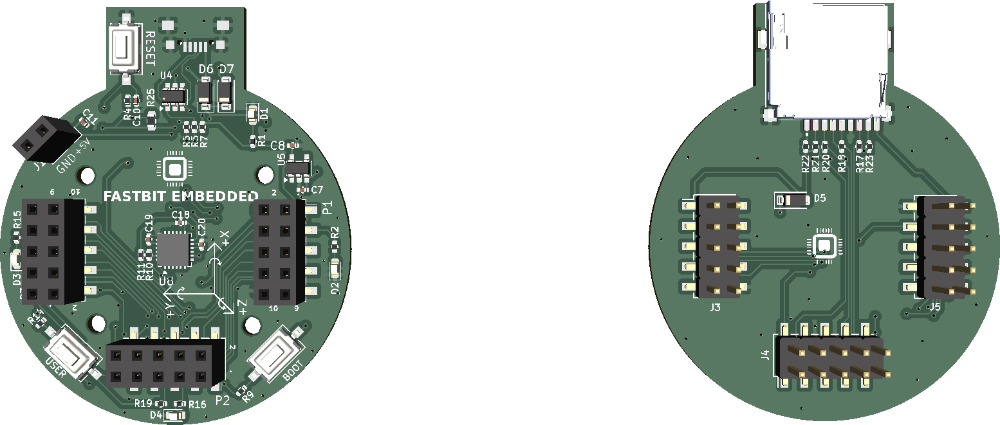
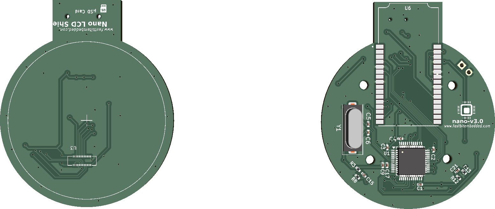

***

<table align="center">
  <tr>
    <td align="center">
      
       <b>Front</b>
    </td>
    <td align="center">
      
       <b>Back</b>
    </td>
  </tr>
</table>

***

## SPECIFICATIONS

| Parameter | Value |
| --- | --- |
| Dimensions | 106.58 × 54.37 mm |

***

## DIRECTORY STRUCTURE

    .
    ├─ Computations       # Misc calculations
    ├─ HTML               # HTML files for generated webpage
    ├─ Images             # Pictures and renders
    │
    ├─ kibot_resources    # External resources for KiBot
    │  ├─ colors          # Color theme for KiCad
    │  ├─ fonts           # Fonts used in the project
    │  ├─ scripts         # External scripts used with KiBot
    │  └─ templates       # Templates for KiBot generated reports
    │
    ├─ kibot_yaml         # KiBot YAML config files
    ├─ KiRI               # KiRI (PCB diff viewer) files
    │
    ├─ lib                # KiCad footprint and symbol libraries
    │  ├─ 3d_models       # Component 3D models
    │  ├─ lib_fp          # Footprint libraries
    │  └─ lib_sym         # Symbol libraries
    │
    ├─ Logos              # Logos
    │
    ├─ Manufacturing      # Assembly and fabrication documents
    │  ├─ Assembly        # Assembly documents (BoM, pos, notes)
    │  │
    │  └─ Fabrication     # Fabrication documents (ZIP, notes)
    │     ├─ Drill Tables # CSV drill tables
    │     └─ Gerbers      # Gerbers
    │
    ├─ Report             # Reports for ERC/DRC
    ├─ Schematic          # PDF of schematic
    ├─ Templates          # Title block templates
    ├─ Testing
    │  └─ Testpoints      # Testpoints tables
    │
    └─ Variants           # Outputs for assembly variants

  

<h1 align="center"><!--REPO_NAME-->Kicad_Template<!--/REPO_NAME--></h1>

